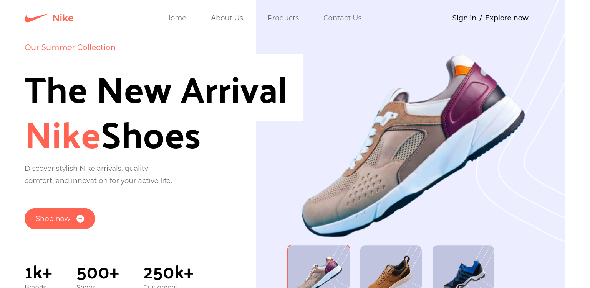

# Nike Landing Page



Welcome to the Nike Landing Page! This is a sample README file to provide you with information about this website.

## Table of Contents

- [Introduction](#introduction)
- [Screenshot](#screenshot)
- [Features](#features)
- [Technologies Used](#technologies-used)
- [Usage](#usage)
- [Installation](#installation)


## Introduction

This website is a landing page for the Nike brand. It showcases a modern and stylish design that represents the brand's identity. The landing page may include various sections such as product highlights, brand information, and more.

You can access the live website [here](https://nike-landing-page-f5616.web.app/).

## Screenshot


## Features

- Modern and stylish design.
- Responsive layout, suitable for various screen sizes.
- Information about Nike products and brand.

## Technologies Used

- HTML
- CSS 
- JavaScript
- ReactJs
- Tailwind CSS

## Usage

Feel free to explore the website and navigate through its sections. You can interact with the navigation menu to scroll smoothly to different sections of the page. The website provides a visually appealing representation of Nike's products and brand.

## Installation

If you'd like to run this website locally, follow these steps:

1. Clone this repository:

   ```bash
   git clone https://github.com/your-username/nike-landing-page.git
   ```
2. Navigate to the project directory:
    ```bash
    cd nike-landing-page
    ```
3. Install dependencies:
    ```bash
        npm install
    ```
4. Start the development server:
    ```bash
        npm run dev
    ```